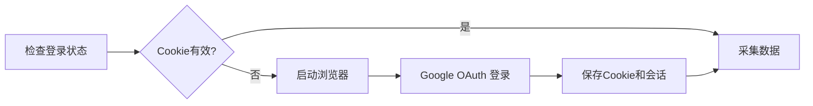

# YST KPI 日报采集 MCP 服务

基于 FastMCP 开发的日报数据自动采集工具，支持从 KPI 系统批量采集指定月份范围的日报数据，并自动生成 Markdown 格式报告。

## 功能特性

- ✅ **自动登录**：使用 Playwright 自动打开浏览器，完成 Google OAuth 登录
- ✅ **持久化会话**：登录一次长期有效，会话数据自动保存
- ✅ **批量采集**：支持一次性采集多个月份的日报数据
- ✅ **智能检测**：自动识别登录状态，7秒检测间隔，不卡顿
- ✅ **格式化输出**：自动生成结构化 Markdown 报告
- ✅ **灵活配置**：支持自定义输出路径和采集范围

## 环境要求

- **Python**: >= 3.10
- **包管理器**: uv
- **浏览器**: Chromium（Playwright 自动安装）
- **网络**: 能访问 `https://kpi.drojian.dev`

## 安装配置

### 1. 安装依赖

```bash
cd /Users/admin/go/empty/python/yst_mcp

# 使用 uv 同步依赖
uv sync

# 激活虚拟环境
source .venv/bin/activate

# 安装 Playwright 浏览器
playwright install chromium
```

### 2. 配置到 Claude Desktop（MCP 使用）

编辑 Claude Desktop 的 MCP 配置文件：

**macOS**: `~/Library/Application Support/Claude/claude_desktop_config.json`

**Windows**: `%APPDATA%\Claude\claude_desktop_config.json`

添加以下配置：

```json
{
  "mcpServers": {
    "yst-mcp": {
      "command": "uv",
      "args": [
        "--directory",
        "/Users/admin/go/empty/python/yst_mcp",
        "run",
        "fastmcp",
        "run",
        "server.py"
      ]
    }
  }
}
```

**注意**：请将路径 `/Users/admin/go/empty/python/yst_mcp` 修改为你的实际项目路径。

保存后，重启 Claude Desktop 即可生效。

## MCP 使用方法

### 快速开始

在 Claude Desktop 中直接对话：

```
使用 yst_mcp 采集 2025-07 到 2025-09 的日报
```

首次使用会自动打开浏览器，完成 Google 登录后，系统会自动：
1. 提取并保存 Cookie
2. 保存浏览器会话
3. 采集指定月份的日报
4. 生成 Markdown 文件

### MCP 工具列表

| 工具名称                      | 功能说明                | 是否必需 |
|------------------------------|------------------------|----------|
| `collect_reports`            | 采集日报（自动登录）      | 核心工具 |
| `browser_login`              | 手动打开浏览器登录        | 可选     |
| `check_login_status`         | 检查登录状态             | 辅助工具 |
| `clear_saved_cookies`        | 清除登录信息             | 辅助工具 |
| `save_cookies_from_browser`  | 手动保存 Cookie（已弃用） | 已弃用   |

### 使用示例

#### 示例 1：基本采集（推荐）
```
使用 yst_mcp 采集 2025-04 到 2025-06 的日报
```

#### 示例 2：自定义输出路径
```
用 yst_mcp 采集 2025-07 月的日报，保存到 /Users/admin/Downloads/july.md
```

#### 示例 3：检查登录状态
```
使用 yst_mcp 检查登录状态
```

#### 示例 4：清除登录信息
```
使用 yst_mcp 清除 Cookie
```

## 本地调试方法

### 方法 1：测试脚本（推荐）

项目提供了 `test_login.py` 测试脚本，用于调试登录功能：

```bash
# 激活虚拟环境
source .venv/bin/activate

# 运行测试脚本
python test_login.py
```

测试脚本会：
1. 启动浏览器
2. 打开登录页面
3. 等待你完成登录
4. 检测登录状态
5. 保存 Cookie 和会话

### 方法 2：开发模式运行

```bash
# 使用 FastMCP 开发模式（带热重载）
uv run fastmcp dev server.py

# 或者生产模式
uv run fastmcp run server.py
```

### 方法 3：直接调用函数

```python
# 创建测试文件 test_collect.py
import asyncio
from report_collector import ReportCollector

async def test():
    collector = ReportCollector()
    result = await collector.collect("2025-07", "2025-09", "output.md")
    print(result)

asyncio.run(test())
```

## 工具详细说明

### 1. collect_reports（核心工具）

采集指定月份范围的日报数据。

**参数**：
- `start_month` (必需): 起始月份，格式 `YYYY-MM`，如 `2025-07`
- `end_month` (必需): 结束月份，格式 `YYYY-MM`，如 `2025-09`
- `output_file` (可选): 输出文件路径，默认 `data/new.md`
- `auto_login` (可选): 是否自动登录，默认 `true`

**返回**：采集结果描述（成功/失败信息）

**示例**：
```
采集 2025-07 到 2025-09 的日报，保存到 /Users/admin/Downloads/reports.md
```

### 2. browser_login

手动打开浏览器进行登录（一般不需要，`collect_reports` 会自动调用）。

**参数**：
- `use_persistent` (可选): 是否使用持久化浏览器，默认 `true`
- `timeout` (可选): 登录超时时间（秒），默认 `300`

**返回**：登录结果

### 3. check_login_status

检查当前登录状态，确认 Cookie 是否有效。

**参数**：无

**返回**：
- `✓ 已登录，Cookie 有效` - 可以正常采集
- `❌ Cookie 已过期` - 需要重新登录
- `❌ 未找到保存的 Cookie` - 首次使用，需要登录

### 4. clear_saved_cookies

清除保存的登录信息（Cookie 和浏览器会话）。

**参数**：无

**返回**：清除结果

**注意**：清除后需要重新登录！同时会删除：
- `data/cookies.json`
- `data/browser_profile/` 目录（19MB 浏览器会话数据）

### 5. save_cookies_from_browser（已弃用）

手动保存浏览器 Cookie 字符串。

**推荐**：直接使用 `collect_reports` 或 `browser_login`，无需手动保存 Cookie。

## 目录结构

```
python/yst_mcp/
├── server.py              # MCP 服务主入口（5 个工具）
├── browser_login.py       # 浏览器自动登录模块
├── cookie_manager.py      # Cookie 持久化管理
├── report_collector.py    # 日报采集核心逻辑
├── test_login.py          # 登录测试脚本
├── pyproject.toml         # uv 项目配置
├── README.md              # 使用说明（本文件）
├── .venv/                 # 虚拟环境
└── data/
    ├── cookies.json       # Cookie 存储文件（8KB）
    ├── browser_profile/   # 浏览器持久化会话（19MB）
    └── new.md             # 默认输出文件
```

## 工作原理

### 1. 登录流程



**详细步骤**：
1. 检查 `data/cookies.json` 和 `data/browser_profile/` 是否存在
2. 如果不存在，启动 Playwright 浏览器
3. 打开 `https://kpi.drojian.dev/report/report-daily/my-list`
4. 等待用户完成 Google OAuth 登录
5. 每 7 秒检测一次登录状态：
   - URL 包含 `kpi.drojian.dev` → 已登录
   - URL 包含 `my-list` → 登录成功
6. 提取 Cookie 并保存到 `data/cookies.json`
7. 浏览器会话保存到 `data/browser_profile/`

### 2. 数据采集流程

```
遍历月份 → 访问页面 → 解析HTML → 提取数据 → 生成Markdown
```

**详细步骤**：
1. 遍历起始月份到结束月份（如 2025-07 到 2025-09）
2. 对每个月份，访问：
   ```
   https://kpi.drojian.dev/report/report-daily/my-list?month=YYYY-MM
   ```
3. 使用 requests + Cookie 获取页面内容
4. 使用 BeautifulSoup 解析 HTML，提取 `#report_list li` 元素
5. 提取日报信息：
   - 标题（包含日期、时间、早/晚报标记）
   - 内容（今日计划、今日完成等）
6. 按月份组织数据，生成 Markdown 文件

### 3. 输出格式

```markdown
# YST 日报整理

生成时间：2025-10-05 10:43:48

## 2025-07 月份日报 (22 条)

### 1. 2025-07-30早报:09:41weather（#郑潇）
当前任务：线上服务开发和测试

今日计划:
1. weather配合继续测试
2. 冷备份数据继续处理
...

---

### 2. 2025-07-29早报:09:12weather（#郑潇）
...
```

## 注意事项

### 安全性

1. ⚠️ **Cookie 安全**：`data/cookies.json` 包含登录凭证，请勿分享或提交到 Git
2. ⚠️ **会话数据**：`data/browser_profile/` 包含完整浏览器会话，请勿分享
3. ✅ **建议**：在 `.gitignore` 中添加：
   ```
   data/cookies.json
   data/browser_profile/
   ```

### 性能优化

1. **检测间隔**：登录检测间隔为 7 秒，避免频繁检查
2. **超时时间**：登录超时时间为 5 分钟（300 秒）
3. **持久化会话**：首次登录后，浏览器会话自动保存，下次无需重复登录

### 已知限制

1. **网络依赖**：需要稳定的网络连接访问 `kpi.drojian.dev`
2. **页面结构**：依赖页面 HTML 结构（`#report_list`），如有变化需调整解析逻辑
3. **浏览器依赖**：需要 Chromium 浏览器（Playwright 自动管理）

## 常见问题

### Q1: 登录一直卡住不动？

**现象**：已经登录了，但检测还在等待

**原因**：登录后停留在其他页面（如 `/work/app/index`），未跳转到日报页面

**解决**：最新版本已修复，会自动检测登录状态并跳转到日报页面

### Q2: 提示 Cookie 无效？

**解决方法**：
```bash
# 方法 1：使用 MCP 工具
使用 yst_mcp 清除 Cookie
使用 yst_mcp 采集 2025-07 到 2025-09 的日报  # 会自动重新登录

# 方法 2：手动清理
rm -rf data/cookies.json data/browser_profile/
```

### Q3: 浏览器启动失败？

**错误信息**：`Executable doesn't exist at .../chromium-1187/...`

**解决方法**：
```bash
# 安装 Playwright 浏览器
source .venv/bin/activate
playwright install chromium
```

### Q4: 网络连接错误？

**错误信息**：`net::ERR_CONNECTION_RESET`

**解决方法**：
- 检查网络连接
- 确认能访问 `https://kpi.drojian.dev`
- 最新版本已添加错误处理，会自动重试

### Q5: 如何完全清除登录信息？

```bash
# 清除所有登录数据（Cookie + 浏览器会话）
rm -rf data/cookies.json
rm -rf data/browser_profile/
```

**注意**：
- `clear_saved_cookies` 只清除 `cookies.json`
- 浏览器会话保存在 `browser_profile/`（19MB）
- 完全清除需要删除两者

### Q6: 可以同时采集多个不同的月份范围吗？

可以，但需要分多次调用。例如：
```
采集 2025-01 到 2025-03 的日报，保存到 q1.md
采集 2025-04 到 2025-06 的日报，保存到 q2.md
```

### Q7: 输出文件可以放在任意位置吗？

可以！支持绝对路径和相对路径：
```
# 绝对路径
保存到 /Users/admin/Downloads/report.md

# 相对路径（相对于项目目录）
保存到 reports/2025-07.md
```

## 开发者信息

- **项目类型**: MCP 服务
- **开发框架**: FastMCP
- **Python 版本**: >= 3.10
- **包管理**: uv
- **浏览器自动化**: Playwright (async API)
- **HTTP 请求**: requests + BeautifulSoup4
- **数据格式**: Markdown

## 更新日志

### v2.0 (2025-10-05)
- ✅ 使用 Playwright 实现自动登录
- ✅ 持久化浏览器会话
- ✅ 优化登录检测逻辑（7秒间隔）
- ✅ 自动识别已登录状态并跳转
- ✅ 添加错误处理和重试机制

### v1.0 (2025-10-02)
- ✅ 基础日报采集功能
- ✅ Cookie 持久化存储
- ✅ Markdown 格式输出

## 技术支持

如遇问题，请检查：
1. ✅ Python 版本 >= 3.10
2. ✅ 已执行 `uv sync` 安装依赖
3. ✅ 已执行 `playwright install chromium`
4. ✅ 网络能访问 `https://kpi.drojian.dev`
5. ✅ MCP 配置路径正确

更多问题请查看[常见问题](#常见问题)部分。
